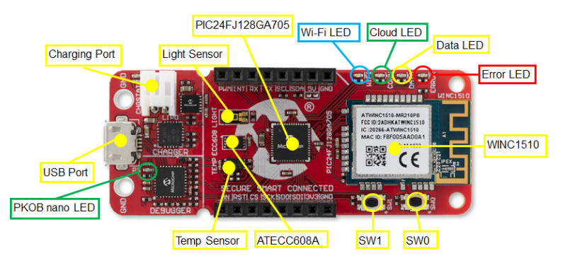
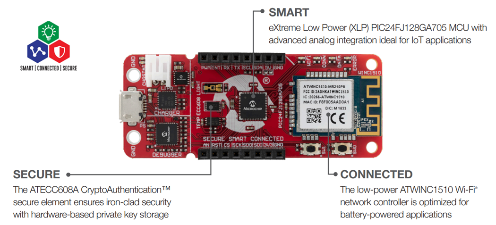
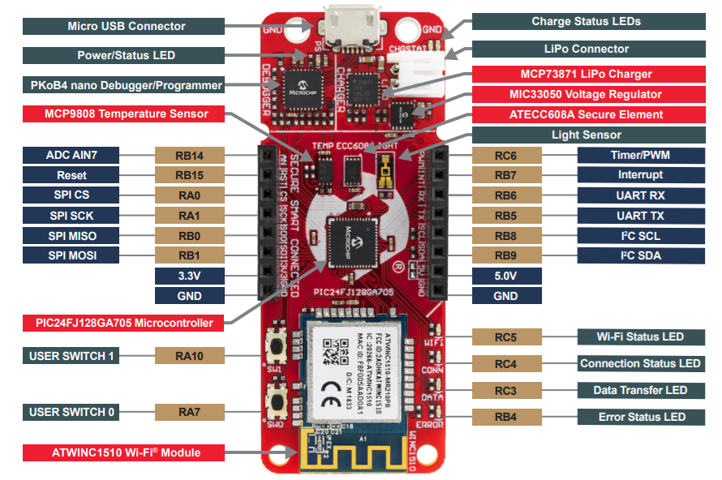

#Microchip PIC-IoT Wx (WG, WA, WM)

##Overview

The Microchip PIC-IoT Wx board is a small platform for development IoT Solutions based on 3 main blocks: Smart (microcontroller), Secure (secure element) and Connected (Wi-Fi module).
The variants WA and WG refers to a pre-programmed solutions using Amazon Web Services (WA) or Google Cloud IoT Core (WG) or Microsoft Azure (WM).

##Hardware

The board features the following elements:

+ On-board debugger 

##Development Environment
+ IDE: MPLABX Version 6.0
+ Compiler: XC16 Version 2.41

##References
+ https://iot.microchip.com/pic-iot
+ https://www.microchip.com/en-us/development-tool/AC164164
+ https://github.com/microchip-pic-avr-solutions/pic-iot-aws-sensor-node
+ https://github.com/microchip-pic-avr-solutions/microchip-iot-developer-guides-for-aws
+ https://github.com/Azure-Samples/Microchip-PIC-IoT-Wx
+ https://www.microchip.com/en-us/product/PIC24FJ128GA705
+ https://www.microchip.com/en-us/product/ATECC608A
+ https://www.microchip.com/en-us/product/ATWINC1500
